* Reference Material
** Vite
- create new vite project
#+BEGIN_SRC

  - create the new project
  npm create vite@latest

  - install it at the location
  cd part1
  npm install

#+END_SRC 
- start vite project
#+BEGIN_SRC

 - npm run dev
 - can wath it at localhost:5173

 #+END_SRC
- can delete App.css, index.css and assets directory
** axios
*** local
- run npm install axios in project root
- run this command to start the server
  #+BEGIN_SRC json :results output
npx json-server --port 3001 db.json
#+END_SRC
- make below changes to add json db
  #+BEGIN_SRC json :results output
{
  "name": "phonebook",
  "private": true,
  "version": "0.0.0",
  "type": "module",
  "scripts": {
    "dev": "vite",
    "build": "vite build",
    "lint": "eslint .",
    "preview": "vite preview",
    "server": "json-server -p 3001 db.json" ;; CHANGE HERE
  },
  "dependencies": {
    "axios": "^1.13.2",
    "react": "^19.2.0",
    "react-dom": "^19.2.0"
  },
  "devDependencies": {
    "@eslint/js": "^9.39.1",
    "@types/react": "^19.2.5",
    "@types/react-dom": "^19.2.3",
    "@vitejs/plugin-react": "^5.1.1",
    "eslint": "^9.39.1",
    "eslint-plugin-react-hooks": "^7.0.1",
    "eslint-plugin-react-refresh": "^0.4.24",
    "globals": "^16.5.0",
    "json-server": "^1.0.0-beta.3",  ;; AND HERE
    "vite": "^7.2.4"
  }
}
#+END_SRC
** 1.d
  [[https://react.dev/learn][official React documentation]]
  [[https://egghead.io/courses/the-beginner-s-guide-to-react ][beginner guide to react]]
  [[https://developer.mozilla.org/en-US/docs/Learn_web_development/Core/Structuring_content/HTML_table_basics][HTML Table basics]]
* Exercises
** 0.4
#+BEGIN_SRC mermaid :file ./images/diagram.png
  sequenceDiagram
  participant browser
  participant server

  Note right of browser: the browser sends text note in payload

  browser->>server: POST https://studies.cs.helsinki.fi/exampleapp/new_note
  activate server
  note left of server: server adds payload to notes array
  server-->>browser: Status 302 redirect
  deactivate server

  browser->>server: GET https://studies.cs.helsinki.fi/exampleapp/notes
  activate server
  server-->>browser: the HTML document
  deactivate server

  browser->>server: GET https://studies.cs.helsinki.fi/exampleapp/main.css
  activate server
  server-->>browser: The CSS file
  deactivate server

  browser->>server: GET https://studies.cs.helsinki.fi/exampleapp/main.js
  activate server
  server-->>browser: The javascript file
      deactivate server

  note right of browser: the browser starts executing the javascript code

  browser->>server: GET https://studies.cs.helsinki.fi/exampleapp/data.json
  activate server
  server-->>browser: The json file
  deactivate server

#+END_SRC

#+RESULTS:
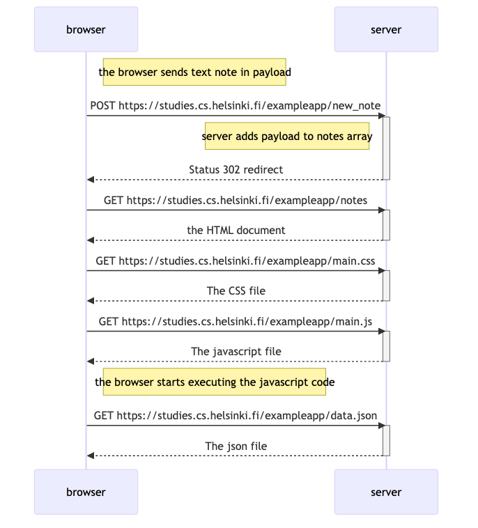

#+RESU`LTS:
[[file:diagram.png]]

** 0.5
#+BEGIN_SRC mermaid :file ./images/spa_diagram.png
  sequenceDiagram
    participant browser
    participant server
      
      browser->>server: GET https://studies.cs.helsinki.fi/exampleapp/spa

      activate server
      server-->>browser: the HTML document
      deactivate server

      browser->>server: GET https://studies.cs.helsinki.fi/exampleapp/main.css
      activate server
      server-->>browser: the CSS file
      deactivate server

      browser->>server: GET https://studies.cs.helsinki.fi/exampleapp/spa.js
      activate server
      server-->>browser: the javascript file
      deactivate server

      browser->>server: GET https://studies.cs.helsinki.fi/exampleapp/data.json
      activate server
      server-->>browser: the json file
      deactivate server

    
      
      
#+END_SRC

#+RESULTS:
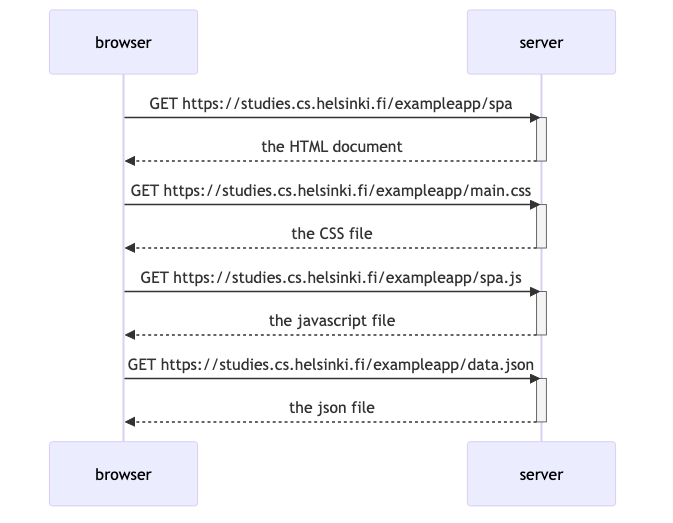

** 0.6
#+BEGIN_SRC mermaid :file ./images/0.6_New_note_in_single_page_app.diagram.png
  sequenceDiagram
      participant browser
      participant server

      Note right of browser: the browswer sends the json payload
      activate browser
      browser->>server: POST https://studies.cs.helsinki.fi/exampleapp/new_note_spa
      deactivate browser

      activate server
      deactivate server
#+END_SRC

#+RESULTS:
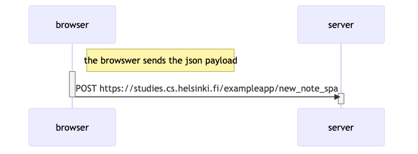
** 1.1
#+BEGIN_SRC jsx :results output
const Header = (props) => {
  console.log(props)
  return (
    <>
    <h1>
      {props.course}
    </h1>
    </>
  )
}

const Part = (props) => {
  console.log(props)
  return (
    <>
    

      {props.part} {props.exercise_count}
    

    </>
  )
}

const Content = (props) => {
  console.log(props)
  return (
    

      <Part part={props.parts[0]} exercise_count={props.exercise_counts[0]}/>
      <Part part={props.parts[1]} exercise_count={props.exercise_counts[1]}/>
      <Part part={props.parts[2]} exercise_count={props.exercise_counts[2]}/>
    

  )
}

const Total = (props) => {
  console.log(props)
  return (
    <>
    

      Number of exercises {props.number}
    

    </>
  )
}

const App = () => {
  const course = 'Half Stack application development'
  const part1 = 'Fundamentals of Redact'
  const exercises1 = 10
  const part2 = 'Using props to pass data'
  const exercises2 = 7
  const part3 = 'State of a component'
  const exercises3 = 14

  return (
    

      <Header course={course}/>
      <Content parts={[part1, part2, part3]}
               exercise_counts={[exercises1, exercises2,exercises3]}/>
      <Total number={exercises1 + exercises2 + exercises3}/>
    

  )
}

export default App

#+END_SRC
** 1.2
#+BEGIN_SRC jsx :results output
const Header = (props) => {
  console.log(props)
  return (
    <>
    <h1>
      {props.course}        
    </h1>
    </>
  )
}

const Part = (props) => {
  console.log(props)
  return (
    <>
    

      {props.part} {props.exercise_count}
    

    </>
  )
}

const Content = (props) => {
  console.log(props)
  return (
    

      <Part part={props.parts[0]} exercise_count={props.exercise_counts[0]}/>
      <Part part={props.parts[1]} exercise_count={props.exercise_counts[1]}/>
      <Part part={props.parts[2]} exercise_count={props.exercise_counts[2]}/>
    

  )
}

const Total = (props) => {
  console.log(props)
  return (
    <>
    

      Number of exercises {props.number}
    

    </>
  )
}

const App = () => {
  const course = 'Half Stack application development'
  const part1 = 'Fundamentals of Redact'
  const exercises1 = 10
  const part2 = 'Using props to pass data'
  const exercises2 = 7
  const part3 = 'State of a component'
  const exercises3 = 14

  return (
    

      <Header course={course}/>
      <Content parts={[part1, part2, part3]}
               exercise_counts={[exercises1, exercises2,exercises3]}/>
      <Total number={exercises1 + exercises2 + exercises3}/>
    

  )
}

export default App

#+END_SRC

* Notes
** React is a JavaScript library
** 1.C - Component state, event handlers
*** Component helper function
- defining a function in another function in Javascript is common.  Not as common in languages like Java.
  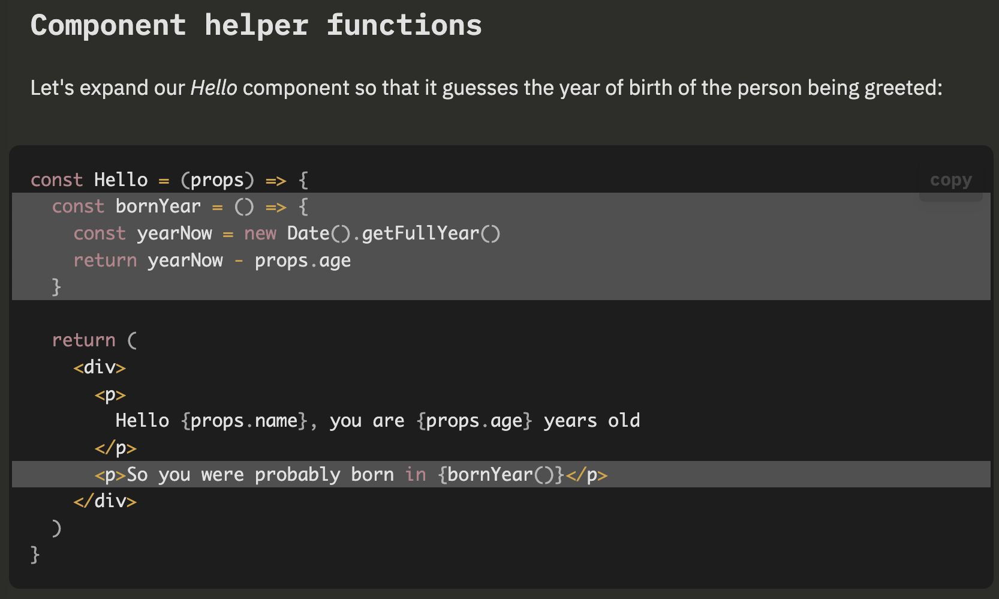
*** Destructuring - (e.g. {name, age} = props)
**** One example - defining outside the parameter
 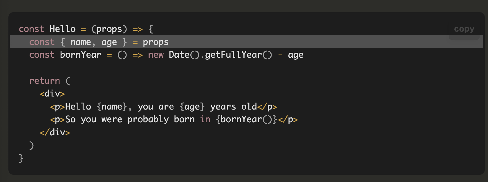
    for
    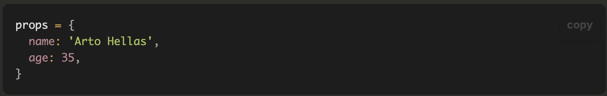

**** Another example - defining inside the parameter
  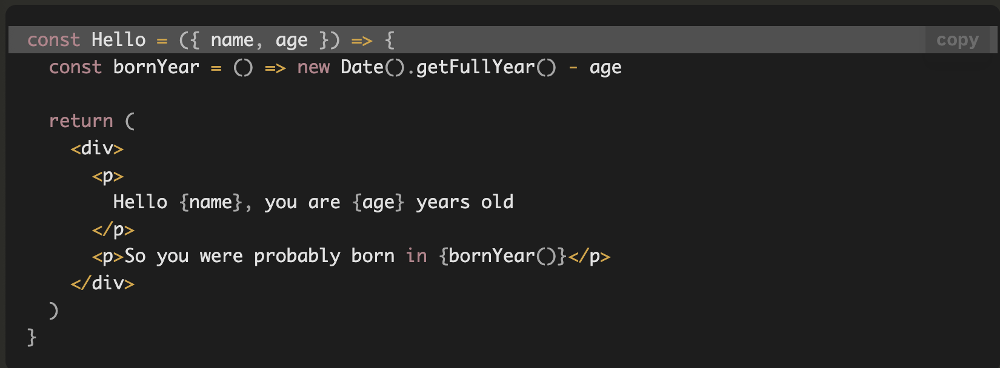

*** Page re-rendering
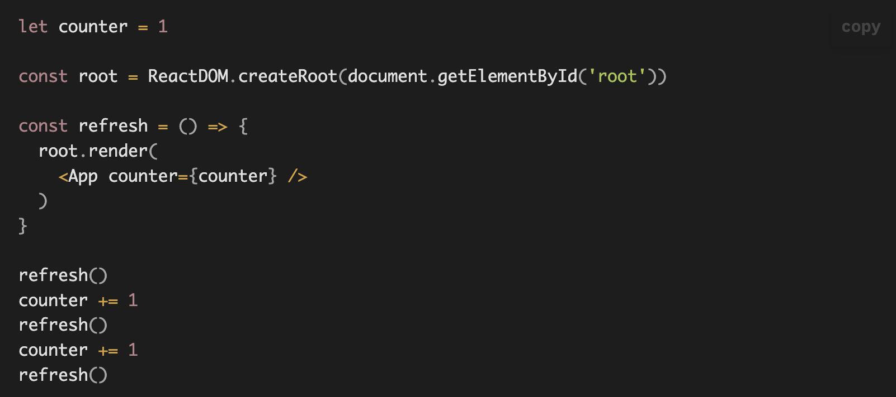

using setInterval to re-render it automatically every second
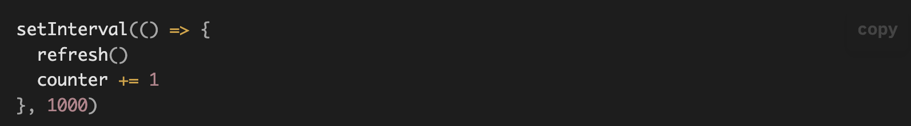

*** Stateful component
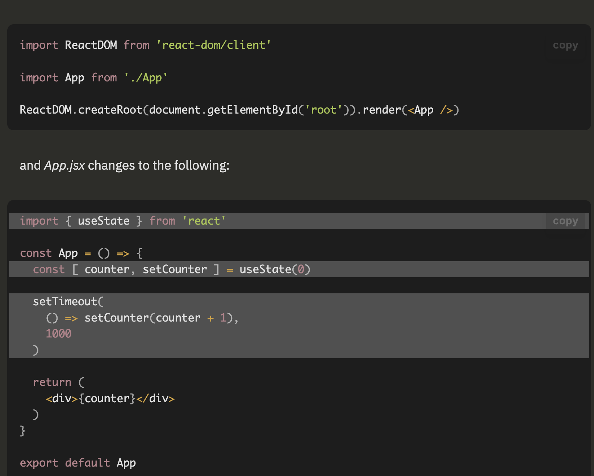

*** Event handing - (buttons)
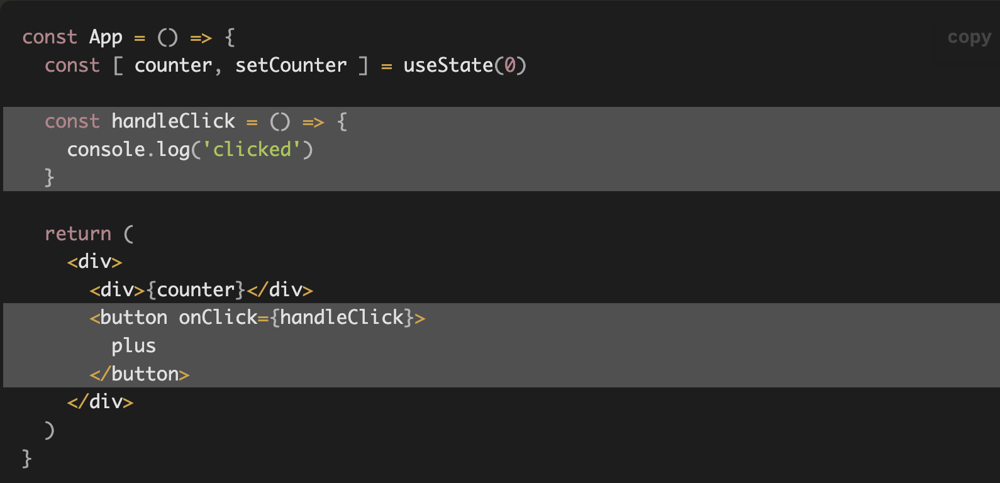

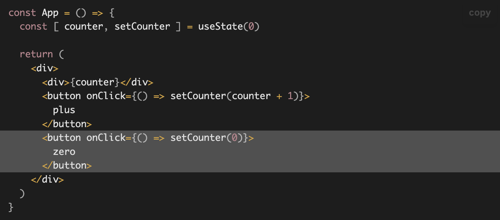

- separating the event handlers into separate functions anyway:
  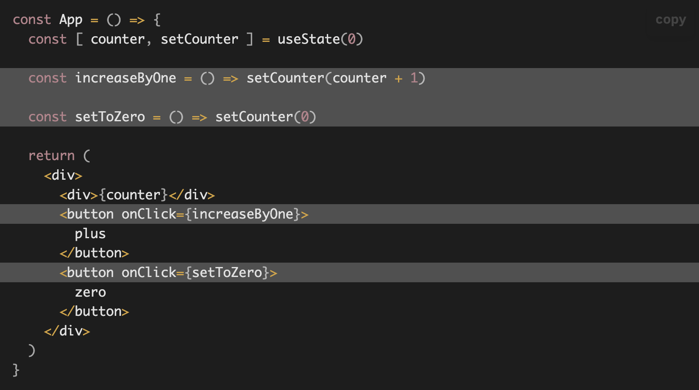

  - event handlers must be a function () =>, not a function call that returns a valeue
*** Passing state - to child components
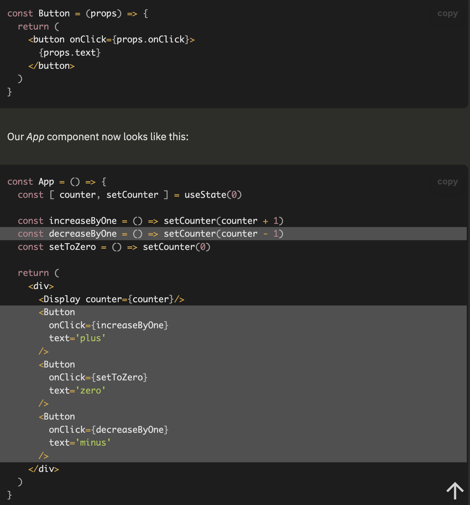

*** Changes in state cause re-rendering
*** Refactoring the components

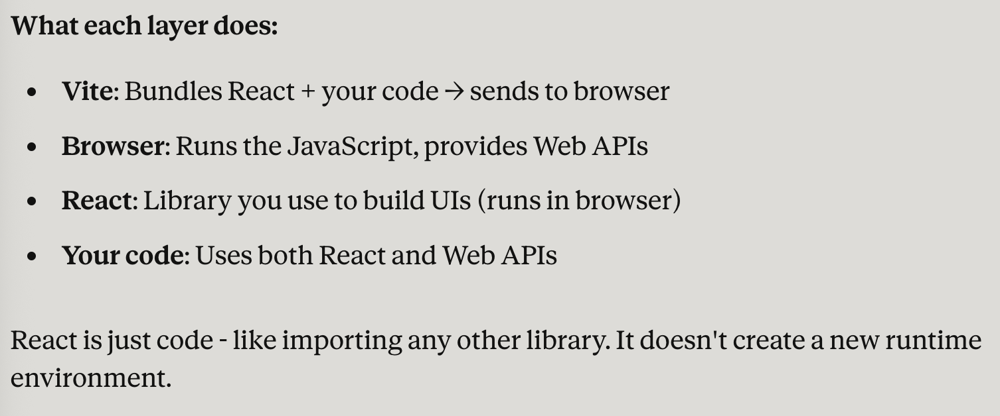

The counter variable is assigned the initial value of state, which is zero. The variable setCounter is assigned a function that will be used to modify the state.
** 1.D - A more complex state, debugging React apps
 - Complex state - multiple "pieces" of state.
 - two consts for each beginning with useState(0)
 - alternate, one piece of state with object with a property for each button.  (both property values  will need
   to be updated on either click.).  Can update the state of the pieces that dont change with object spread.
 - it is forbidden in React to mutate state directly
 - Changing state has to always be done by setting the state to a new object
 - Storing all of the state in a single state object is a bad choice for the left and right button example.
 - Arrays (all clicks concatenated with 'R' or 'L') and displayed on the bottom
 - state update in React happens asyncchronously,(button count example).  using updated value to set total and set new value for new state
 - conditional rendering - movinv allClicks to history component
 - Debugging - add debugger anywhere in code for browser to display in debugger mode.  Components tab. React extension
 - Rules of Hooks - (*what is a hook specifically?* useState function must not be called from inside a loop, a conditional expression, or any place that is not a function defining a component.  rule ensures that hooks are always called in the same order).  It is defined inside a function body that defines a React component'
 - Event Handling Revisited - Event handlers must always be a function or a reference to a function.  This is not the same as the value of a function call (e.g. console.log):
   this (no):
   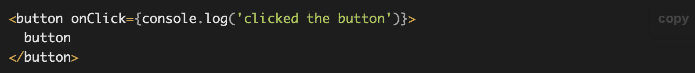
   vs this (yes):
   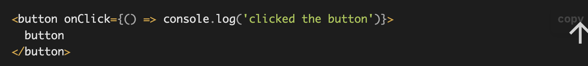

   or this (no):
   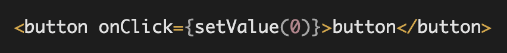

   vs this (yes):
   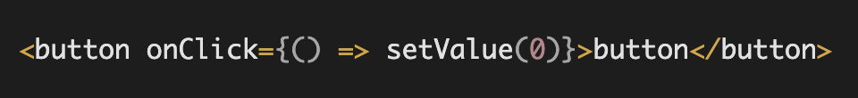
 - A function that returns a function
   Functions returning functions can be utilized in defining generic functionality that can be customized with parameters. goes on about making functions that only have a single return command more compact.
 - Passing Event Handlers to Child Components - talks about creating Button component and passing button label to button component - a child component
 - Do Not Define Components Within Components
** 2.A - Rendering a collection, modules
*** Use map on arrays to display list objects
- remember when using map that you have to first reference the argument ('props') before referencing the part, or else destructuring the argument {arg}
*** use destructuring for props on components to get what is needed
- wrap args of the component in {arg1, arg2 ...}, then can reference them directly in the body instead of having to first reference props object.
** 2.B - Forms
*** event as a parameter in a function can access values of that event through handleNotechange which can access the value through event.value on form.
*** when item is added to an array it creates a new copy with the new item added to the end.  It doesnt mutate the existing array, because change in state established by a change in memory address.  new array = new memory address
** 2.C - Getting Data From the server
*** example of getting data from db.json server
#+BEGIN_SRC js :results output
  const hook = ()  => {
    console.log('effect')
    axios
      .get('http://localhost:3001/notes')
      .then(response => {
        console.log('promise fulfilled')
        setNotes(response.data)
      })
  }

  useEffect(hook, [])
#+END_SRC
** takeaways from assignments
*** use Array spread when copying [...arr] and on Math.max(...arr)

*  Random Scratchpad stuff.  Clear / organize this regularly!
** Asynchronous callbacks from 2.C
- helps with problems associated with blocking which is inherint due to JS single threaded nature
- an example of blocking is when a part of the program takes a long time to run, everything else on the web page is frozen.  cant do anything else until it finishes running.  the commands, clicks etc are still read, but they wont execute until it finishes its current thing
- Asynchronous handles this by below , through concurrency and the event loop. works bc runtime can only do one thing at a time, but the browser has access to other things outside of the runtime.  concurrency kicks in on other pieces of the browser:
  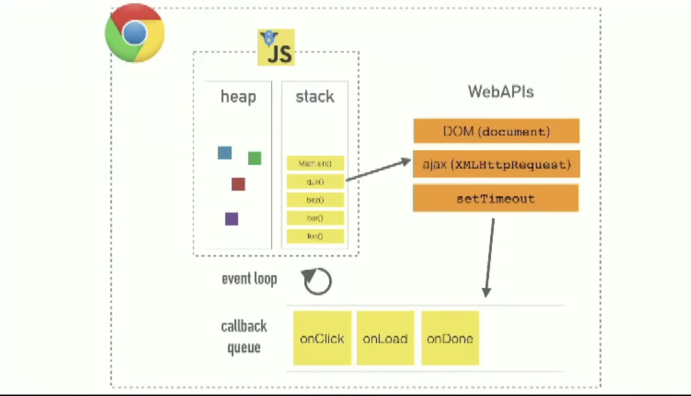
- event loop looks at the stack and looks at the tasks (callback queue).  Ifi the stack is empy, it takes the first thing of the queue, and pushes it onto the stack
- set timeout 0
- settimeout is not a guaranteed time to execution.  It is a minimum time to execution
- callbacks - a function that another function calls, or an asynchronous callback
- synchronous vs asynchronous - no set timeout vs set timeout:
  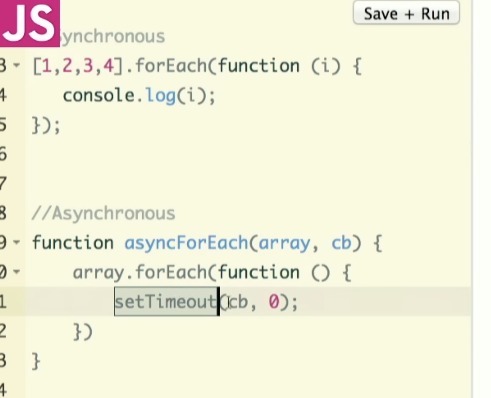
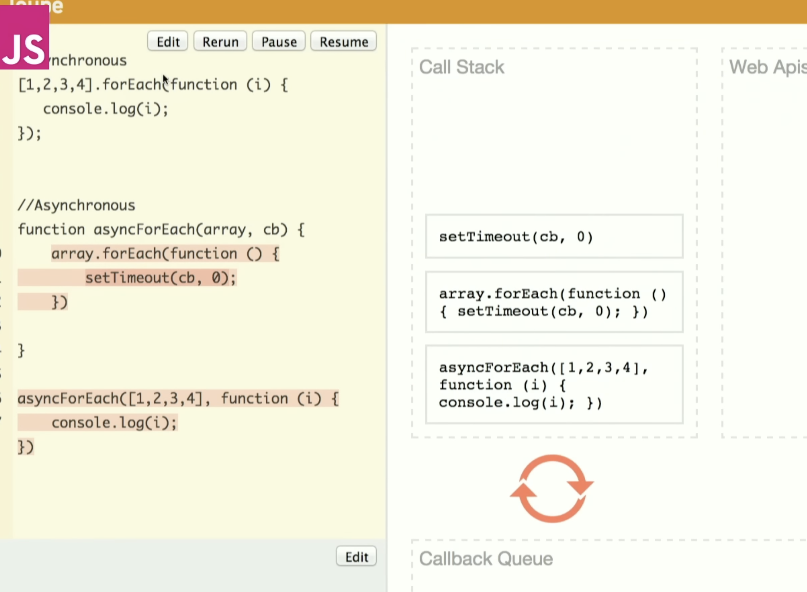
- browser would like to repaint the screen as fast as its frame rate. constrained by what is going on in js.  cant render if there is code in the stack .  Render is like its own callback queue.  But it is given a higher priority than callbacks.  every 16 milliseconds, it queues a render, and whats for the stack to clear before it can do a render.
- while its blocked with things on the stack, cant change things on the screen.  cant click things and see a response:
  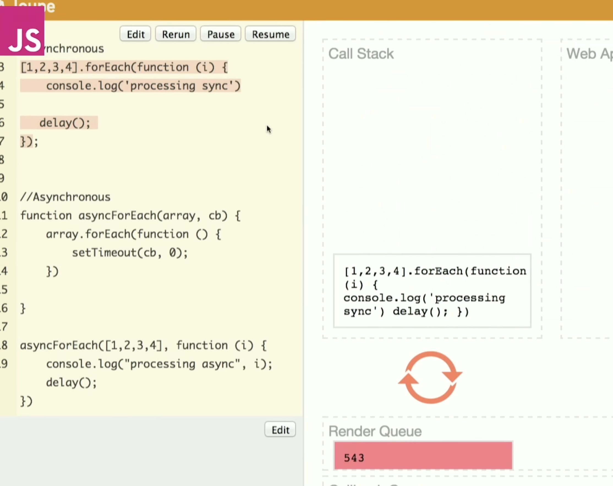
- render given a chance between each element, bc queued up asynchronously and has higher priority than the callback queue.  so it can squeeze itself in:
  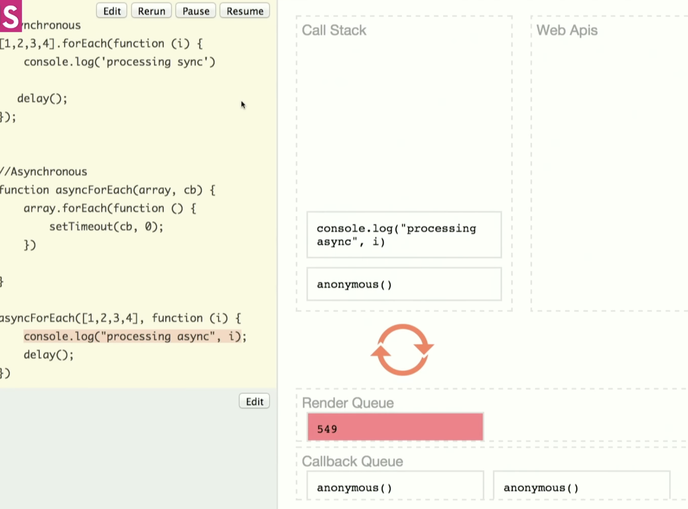
** installing of axios and json-server and parameters, json-server as a develpment dependancy vs axios as a runtime depandancy.  json-only used during development , testing etc.
** hooks - useEffect, onClick etc
** 2.D
*** axios modifying records with axios.put, axios adding records with axios.post, axios retrieving all records with axios.get
