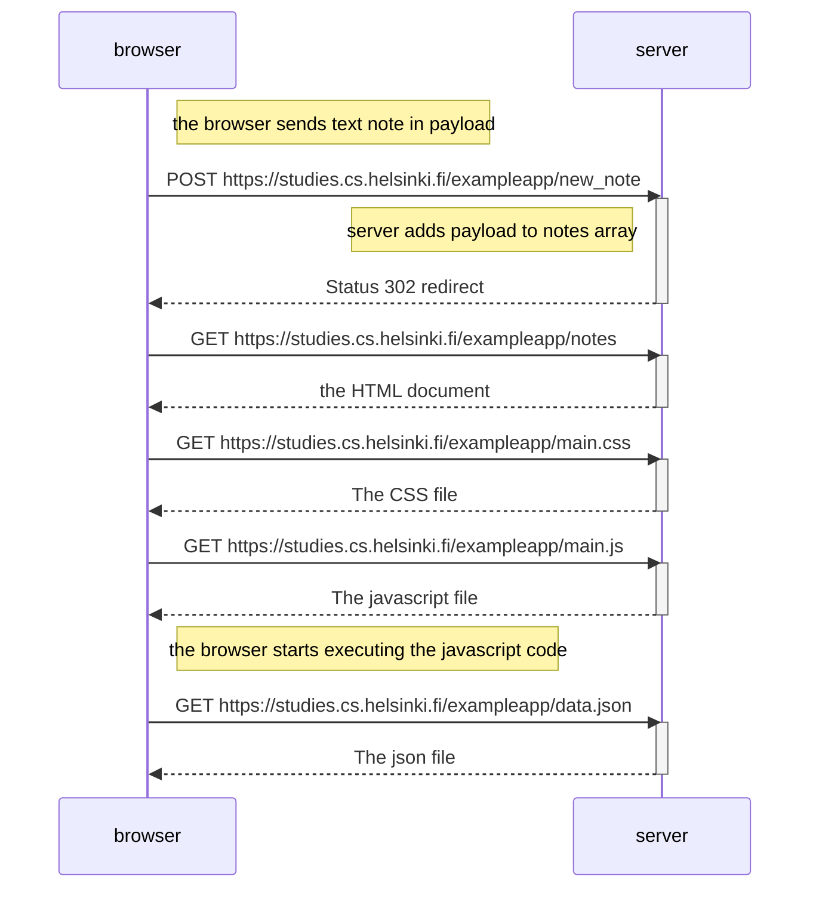

```mermaid
sequenceDiagram
participant browser
participant server

Note right of browser: the browser sends text note in payload

browser->>server: POST https://studies.cs.helsinki.fi/exampleapp/new_note
activate server
note left of server: server adds payload to notes array
server-->>browser: Status 302 redirect
deactivate server

browser->>server: GET https://studies.cs.helsinki.fi/exampleapp/notes
activate server
server-->>browser: the HTML document
deactivate server

browser->>server: GET https://studies.cs.helsinki.fi/exampleapp/main.css
activate server
server-->>browser: The CSS file
deactivate server

browser->>server: GET https://studies.cs.helsinki.fi/exampleapp/main.js
activate server
server-->>browser: The javascript file
deactivate server

note right of browser: the browser starts executing the javascript code

browser->>server: GET https://studies.cs.helsinki.fi/exampleapp/data.json
activate server
server-->>browser: The json file
deactivate server


```